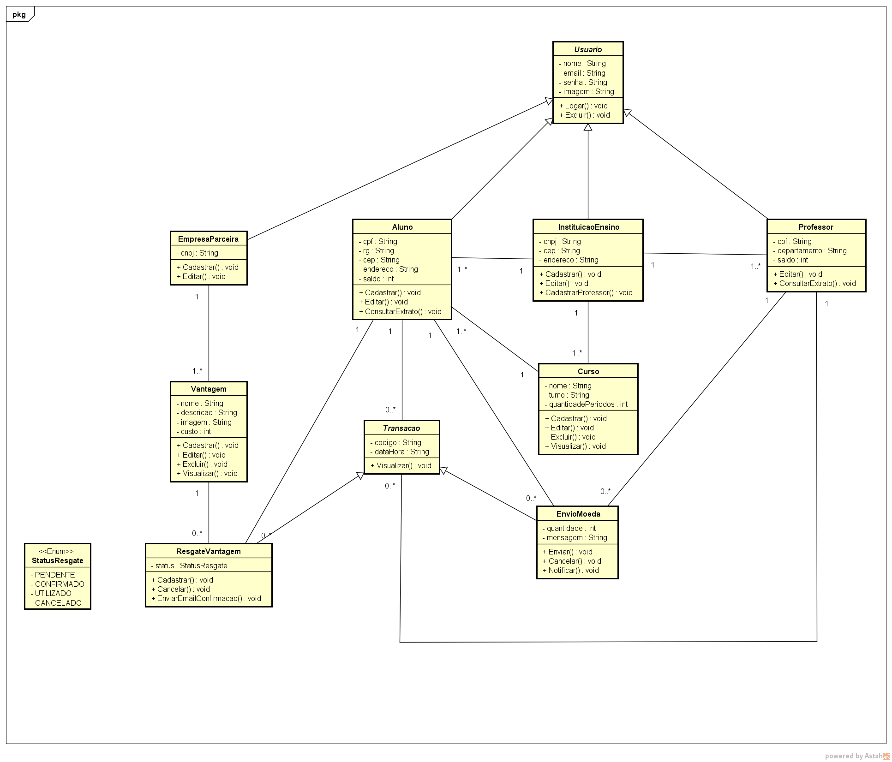
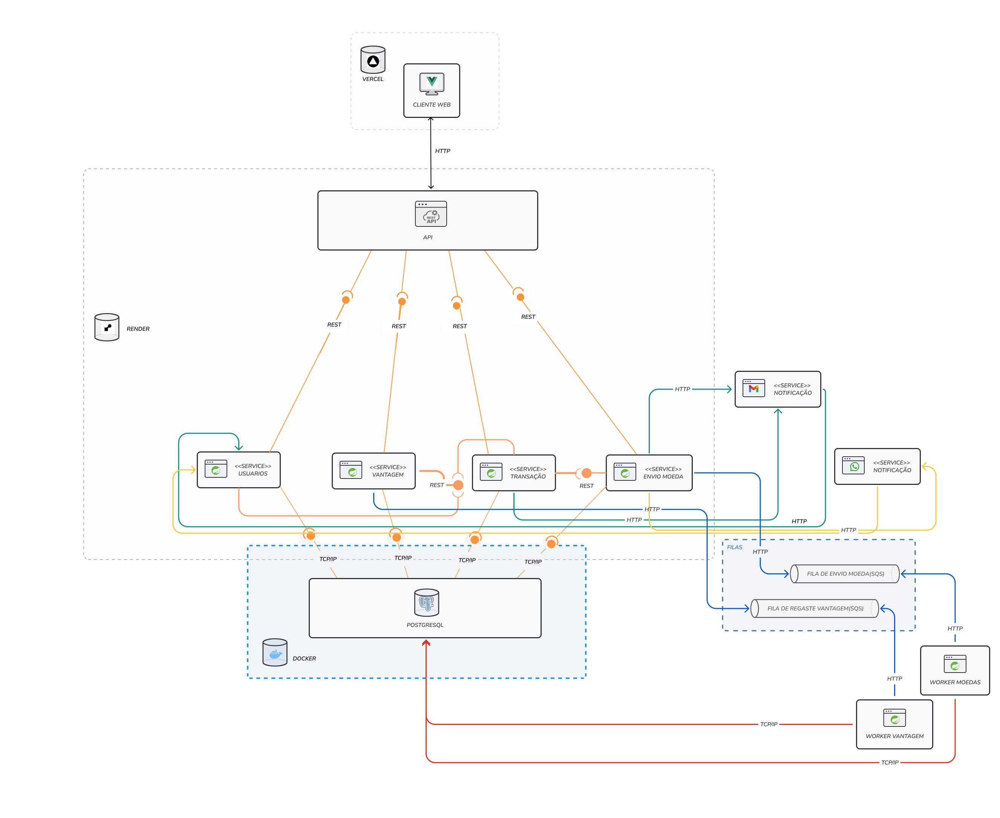
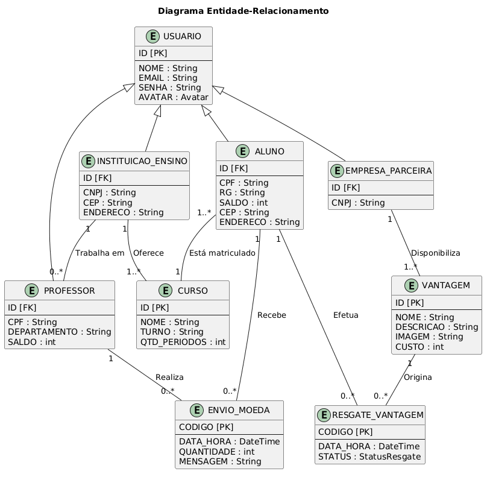
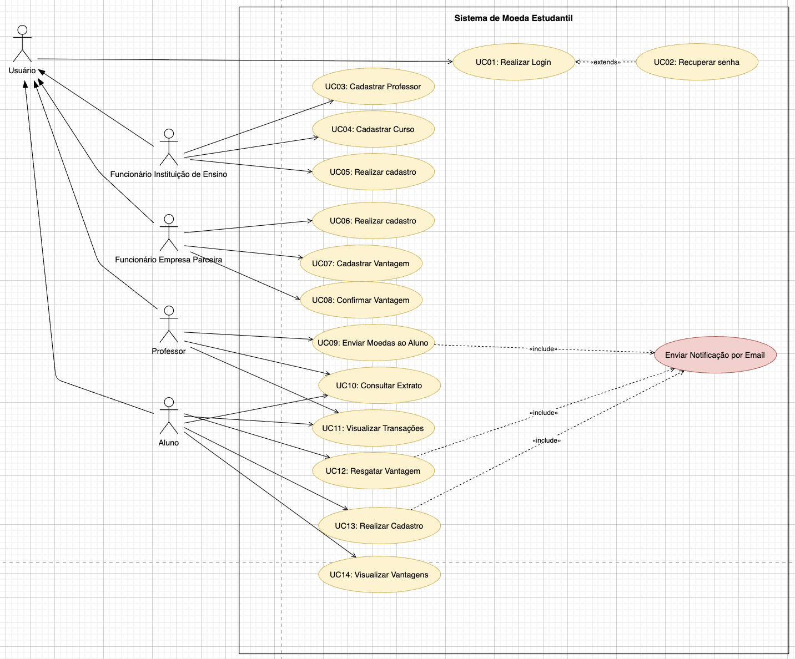

# Lumen Coin


<table>
  <tr>
    <td width="800px">
      <div align="justify">
        O <b>Lumen Coin</b> é um projeto acadêmico desenvolvido na disciplina de <b>Laboratório de Desenvolvimento de Software</b>, do 4º período do Bacharelado em Engenharia de Software da PUC Minas, com o objetivo de aplicar conceitos de modelagem, arquitetura e desenvolvimento de sistemas web. A proposta da aplicação é criar uma plataforma de gamificação acadêmica em que professores possam reconhecer alunos por meio de moedas virtuais, posteriormente utilizadas na troca de vantagens oferecidas por empresas parceiras. O sistema também contempla autenticação de usuários, gerenciamento de transações, consulta de extrato e notificações automáticas por email, promovendo integração entre instituições de ensino, professores, alunos e parceiros.
      </div>
    </td>
    <td>
      <div>
        
      </div>
    </td>
  </tr> 
</table>

---

## 📚 Índice

- [Lumen Coin](#lumen-coin)
    - [📚 Índice](#-índice)
    - [🔗 Links Úteis](#-links-úteis)
    - [📝 Sobre o Projeto](#-sobre-o-projeto)
    - [✨ Funcionalidades Principais](#-funcionalidades-principais)
    - [🛠 Tecnologias Utilizadas](#-tecnologias-utilizadas)
        - [💻 Front-end](#-front-end)
        - [🖥️ Back-end](#️-back-end)
        - [⚙️ Infraestrutura \& DevOps](#️-infraestrutura--devops)
    - [🏗 Arquitetura](#-arquitetura)
        - [📊 Diagramas do Projeto](#-diagramas-do-projeto)
    - [🔧 Instalação e Execução](#-instalação-e-execução)
        - [Pré-requisitos](#pré-requisitos)
        - [🔑 Variáveis de Ambiente](#-variáveis-de-ambiente)
            - [1 Back-end (Spring Boot)](#1-back-end-spring-boot)
            - [2 Front-end (Vue + Vite)](#2-front-end-vue--vite)
        - [📦 Instalação de Dependências](#-instalação-de-dependências)
        - [💾 Inicialização do Banco de Dados (PostgreSQL)](#-inicialização-do-banco-de-dados-postgresql)
        - [⚡ Como Executar a Aplicação](#-como-executar-a-aplicação)
            - [Terminal 1: Back-end (Spring Boot)](#terminal-1-back-end-spring-boot)
            - [Terminal 2: Front-end (Vue + Vite)](#terminal-2-front-end-vue--vite)
        - [🐳 Execução com Docker Compose (somente banco)](#-execução-com-docker-compose-somente-banco)
    - [🚀 Deploy](#-deploy)
    - [📂 Estrutura de Pastas](#-estrutura-de-pastas)
    - [🎥 Demonstração](#-demonstração)
        - [📱 Aplicativo Mobile](#-aplicativo-mobile)
        - [🌐 Aplicação Web](#-aplicação-web)
        - [💻 Exemplo de Saída no Terminal (para Back-end, API, CLI)](#-exemplo-de-saída-no-terminal-para-back-end-api-cli)
            - [1. Demonstração da API (Exemplo com cURL)](#1-demonstração-da-api-exemplo-com-curl)
            - [2. Demonstração de Execução de CLI/Script](#2-demonstração-de-execução-de-cliscript)
    - [🧪 Testes](#-testes)
        - [Testes Unitários e de Integração](#testes-unitários-e-de-integração)
        - [Testes End-to-End (E2E)](#testes-end-to-end-e2e)
    - [🔗 Documentações utilizadas](#-documentações-utilizadas)
    - [👥 Autores](#-autores)
    - [🤝 Contribuição](#-contribuição)
    - [🙏 Agradecimentos](#-agradecimentos)
    - [📄 Licença](#-licença)

---

## 🔗 Links Úteis

- 🎨 **Protótipo da Aplicação:** [Acessar Protótipo](https://retro-coin-cascade.lovable.app)

- 🧩 **Diagrama de Componentes:** [Visualizar no Figma](https://www.figma.com/design/UFdl8puRjqtLsKyNW6Geph/Lumen-Coin?node-id=4-220&p=f&t=53uKn79R5kyCZLDV-0)

---

## 📝 Sobre o Projeto

O <b>Lumen Coin</b> surgiu como uma proposta de aplicação prática dos conhecimentos adquiridos ao longo da disciplina de <b>Laboratório de Desenvolvimento de Software</b>, integrando conceitos de modelagem, arquitetura e desenvolvimento de sistemas web modernos. O projeto busca unir aprendizado técnico e resolução de problemas por meio da construção de uma plataforma completa de gamificação acadêmica.

A aplicação foi pensada para criar um ambiente de reconhecimento e incentivo dentro das instituições de ensino, permitindo que professores distribuam moedas virtuais aos alunos como forma de valorização acadêmica e comportamental. Essas moedas podem posteriormente ser utilizadas na troca de benefícios disponibilizados por empresas parceiras cadastradas na plataforma.

O sistema também simula um cenário real de integração entre diferentes tipos de usuários, envolvendo autenticação, gerenciamento de transações, controle de saldo, notificações automáticas por email e fluxo de resgate de vantagens. Dessa forma, o projeto permite exercitar tanto regras de negócio quanto boas práticas de engenharia de software e desenvolvimento full stack.

Além do contexto acadêmico, o Lumen Coin foi desenvolvido com foco em organização arquitetural, componentização e escalabilidade, servindo como experiência prática na utilização de tecnologias e padrões amplamente adotados no mercado.

---

## ✨ Funcionalidades Principais

- **Autenticação e Segurança:** Login, cadastro e recuperação de senha para diferentes tipos de usuários.
- **Sistema de Moedas Virtuais:** Envio, recebimento e gerenciamento de moedas entre professores e alunos.
- **Resgate de Vantagens:** Troca de moedas por benefícios oferecidos por empresas parceiras.
- **Controle de Transações:** Consulta de saldo, extrato e histórico completo de movimentações.
- **Notificações Automatizadas:** Envio de notificações por email e WhatsApp relacionadas a transações e resgates realizados no sistema.
- **Gerenciamento Acadêmico:** Cadastro e gerenciamento de instituições, cursos, professores e empresas parceiras.

---

## 🛠 Tecnologias Utilizadas

As seguintes ferramentas, frameworks e bibliotecas foram utilizados na construção deste projeto. Recomenda-se o uso das versões listadas (ou superiores) para garantir a compatibilidade.

### 💻 Front-end

- **Framework:** [Vue.js v3.5](https://vuejs.org/)
- **Linguagem:** [TypeScript v6.0](https://www.typescriptlang.org/)
- **Estilização:** [Tailwind CSS v4.2](https://tailwindcss.com/)
- **Gerenciamento de Estado:** [Pinia v3.0](https://pinia.vuejs.org/)
- **Roteamento:** [Vue Router v5.0](https://router.vuejs.org/)
- **Build Tool:** [Vite v8.0](https://vite.dev/)
- **Cliente HTTP:** [Axios v1.16](https://axios-http.com/)
- **Validação de Formulários:** [Zod v4.4](https://zod.dev/)
- **Ícones:** [Phosphor Icons (Vue) v2.2](https://phosphoricons.com/)
- **Máscara de Input:** [Maska v3.2](https://beholdr.github.io/maska/)
- **Notificações (Toast):** [Vue Sonner v2.0](https://vue-sonner.vercel.app/)
- **Formatação de Código:** [Prettier v3.8](https://prettier.io/)

### 🖥️ Back-end

- **Linguagem:** Java 21 (JDK)
- **Framework:** [Spring Boot v3.4.5](https://spring.io/projects/spring-boot)
- **Banco de Dados:** [PostgreSQL 17](https://www.postgresql.org/)
- **ORM:** Hibernate / Spring Data JPA
- **Autenticação:** [Spring Security](https://spring.io/projects/spring-security) + JWT ([JJWT v0.12.6](https://github.com/jwtk/jjwt))
- **Validação:** Jakarta Bean Validation (spring-boot-starter-validation)
- **Mapeamento DTO ↔ Entidade:** [MapStruct v1.5.5](https://mapstruct.org/)
- **Redução de Boilerplate:** [Lombok](https://projectlombok.org/)
- **Armazenamento de Imagens:** [Cloudinary SDK v1.38.0](https://cloudinary.com/documentation/java_integration)
- **Geração de QR Code:** [ZXing v3.5.3](https://github.com/zxing/zxing)
- **Templates de Email:** [Handlebars v4.4](https://github.com/jknack/handlebars.java)
- **Message Broker:** [Spring AMQP](https://spring.io/projects/spring-amqp) (integração com RabbitMQ)
- **Build Tool:** [Maven](https://maven.apache.org/)

### ⚙️ Infraestrutura & DevOps

- **Containerização:** [Docker / Docker Compose](https://www.docker.com/) (PostgreSQL e RabbitMQ)
- **Message Broker:** [RabbitMQ v4.0](https://www.rabbitmq.com/) (processamento assíncrono de notificações)
- **Armazenamento de Imagens:** [Cloudinary](https://cloudinary.com/) (upload e gerenciamento de imagens em nuvem)
- **Email (Produção):** [Brevo SMTP](https://www.brevo.com/) (envio de emails transacionais)

---

## 🏗 Arquitetura

O <b>Lumen Coin</b> foi desenvolvido utilizando uma arquitetura baseada em <b>monólito modular</b>, permitindo organizar o sistema em módulos coesos e independentes, mantendo simplicidade no desenvolvimento e facilidade de manutenção. Essa abordagem foi escolhida por oferecer uma boa separação de responsabilidades sem adicionar a complexidade operacional de microsserviços, sendo adequada ao escopo acadêmico e ao porte da aplicação.

No back-end, a aplicação segue uma arquitetura em camadas utilizando <b>Spring Boot</b>, separando responsabilidades entre controladores, serviços, repositórios e entidades. Esse modelo facilita a organização do código, reutilização de regras de negócio e manutenção da aplicação ao longo do desenvolvimento.

A camada de persistência utiliza <b>Spring Data JPA</b> em conjunto com <b>PostgreSQL</b>, aplicando padrões como <b>Repository</b> e utilização de <b>DTOs</b> para transferência de dados entre as camadas da aplicação.

No front-end, a aplicação foi estruturada utilizando <b>Feature-Based Architecture com Shared Layer</b>, organizando funcionalidades por domínio e promovendo reutilização de componentes, serviços e estados compartilhados.

Além disso, o ambiente da aplicação é containerizado com <b>Docker</b>, permitindo padronização do ambiente de desenvolvimento, isolamento de dependências e maior facilidade de execução e manutenção do sistema.

### 📊 Diagramas do Projeto

Os principais diagramas utilizados na modelagem e documentação do sistema estão organizados abaixo, auxiliando na visualização da arquitetura, regras de negócio e estrutura de dados da aplicação.

|                                         Diagrama de Classes                                         |                                             Diagrama de Componentes                                             |
| :-------------------------------------------------------------------------------------------------: | :-------------------------------------------------------------------------------------------------------------: |
|                           **Estrutura das Entidades e Regras de Negócio**                           |                                    **Organização Arquitetural da Aplicação**                                    |
|  |  |

|                                      Diagrama Entidade-Relacionamento                                      |                                        Diagrama de Caso de Uso                                        |
| :--------------------------------------------------------------------------------------------------------: | :---------------------------------------------------------------------------------------------------: |
|                                      **Modelagem do Banco de Dados**                                       |                              **Interações e Funcionalidades do Sistema**                              |
|  |  |

---

## 🔧 Instalação e Execução

### Pré-requisitos

Antes de iniciar, garanta que os seguintes requisitos estejam instalados:

- **Java JDK 21+** (obrigatório para o back-end Spring Boot)
- **Node.js LTS 18+** (recomendado 22+) para o front-end Vue + Vite
- **npm** (já incluído com Node.js)
- **Docker + Docker Compose** (recomendado para subir o PostgreSQL local)

---

### 🔑 Variáveis de Ambiente

O projeto usa variáveis de ambiente no **back-end** (`server`) e no **front-end** (`client`).

#### 1 Back-end (Spring Boot)

Na pasta `server`, copie o arquivo de exemplo:

```bash
# Linux/macOS
cp .env.example .env
```

```powershell
# Windows PowerShell
Copy-Item .env.example .env
```

Depois, edite o arquivo `server/.env` com os valores do seu ambiente.

| Variável            | Descrição                                                     | Exemplo                                       |
| :------------------ | :------------------------------------------------------------ | :-------------------------------------------- |
| `SERVER_PORT`       | Porta onde o Back-end será executado.                         | `8080`                                        |
| `DB_HOST`           | Host do PostgreSQL.                                           | `localhost`                                   |
| `DB_PORT`           | Porta do PostgreSQL.                                          | `5432`                                        |
| `DB_NAME`           | Nome do banco de dados.                                       | `lumen-coin-db`                               |
| `DB_USER`           | Usuário do banco de dados.                                    | `lumen`                                       |
| `DB_PASSWORD`       | Senha do banco de dados.                                      | `sua_senha_segura`                            |
| `JPA_DDL_AUTO`      | Estratégia Hibernate DDL (`update`, `create`, `validate`).    | `update`                                      |
| `JPA_SHOW_SQL`      | Log de SQL queries no console.                                | `false`                                       |
| `BCRYPT_STRENGTH`   | Força do BCrypt (2^N rounds, mínimo 10, recomendado 12+).     | `12`                                          |
| `JWT_SECRET`        | Chave HMAC-SHA256 para assinar tokens (mínimo 256 bits).      | `base64_gerado_com_openssl`                   |
| `JWT_EXPIRATION_MS` | Tempo de expiração do token JWT em milissegundos.             | `86400000` (24 horas)                         |
| `JWT_COOKIE_NAME`   | Nome do cookie de autenticação HTTP-only.                     | `lumen_auth`                                  |
| `JWT_COOKIE_SECURE` | Cookie enviado apenas via HTTPS (false em dev, true em prod). | `false`                                       |
| `ALLOWED_ORIGINS`   | Origens permitidas no CORS (lista separada por vírgula).      | `http://localhost:5173,http://localhost:5174` |

Para gerar uma chave JWT segura:

```bash
openssl rand -base64 32
```

#### 2 Front-end (Vue + Vite)

O front-end lê `VITE_API_URL` via `import.meta.env`. Na pasta `client`, crie um arquivo `.env` com:

```bash
VITE_API_URL=http://localhost:8080
```

Observação: em projetos Vite, somente variáveis com prefixo `VITE_` ficam disponíveis no código cliente.

### 📦 Instalação de Dependências

Com o repositório já clonado, instale as dependências do front-end e valide o back-end.

1. **Front-end (`client`)**

```bash
cd client
npm install
cd ..
```

2. **Back-end (`server`)**

No back-end, o Maven Wrapper já está versionado no projeto (`mvnw` / `mvnw.cmd`).

```bash
cd server
./mvnw clean install
cd ..
```

No Windows PowerShell, utilize:

```powershell
cd server
.\mvnw.cmd clean install
cd ..
```

---

### 💾 Inicialização do Banco de Dados (PostgreSQL)

O arquivo `server/docker-compose.yml` sobe o PostgreSQL 17 com os parâmetros do `.env`.

```bash
cd server
docker compose up -d
cd ..
```

No Windows PowerShell, o comando é o mesmo:

```powershell
cd server
docker compose up -d
cd ..
```

Para verificar se o banco está saudável:

```bash
docker ps
```

O schema é aplicado automaticamente pelo Spring Boot via Hibernate (`JPA_DDL_AUTO`).

---

### ⚡ Como Executar a Aplicação

Execute em dois terminais separados: um para API e outro para o front-end.

#### Terminal 1: Back-end (Spring Boot)

Linux/macOS:

```bash
cd server
./mvnw spring-boot:run
```

Windows PowerShell:

```powershell
cd server
.\mvnw.cmd spring-boot:run
```

API disponível em: `http://localhost:8080`

---

#### Terminal 2: Front-end (Vue + Vite)

```bash
cd client
npm run dev
```

Aplicação web disponível em: `http://localhost:5173`

---

### 🐳 Execução com Docker Compose (somente banco)

Neste repositório, o `docker compose` da pasta `server` orquestra o **PostgreSQL** e o **RabbitMQ**. O back-end e o front-end continuam sendo executados localmente com Maven Wrapper e Vite.

Fluxo recomendado:

1. Subir banco com `docker compose up -d` dentro de `server`
2. Executar API (`mvnw spring-boot:run`)
3. Executar front-end (`npm run dev` em `client`)

Para encerrar o banco:

```bash
cd server
docker compose down
cd ..
```

---

## 🚀 Deploy

O Lumen Coin usa **Vercel** para o front-end (Vue + Vite) e **Render** para o back-end (Spring Boot). Ambos os provedores oferecem deploys automáticos a partir do repositório Git.

### 📦 Pré-requisitos para Deploy

- Repositório Git sincronizado com GitHub/GitLab
- Conta **Vercel** (gratuita ou paga)
- Conta **Render** (gratuita ou paga)
- Banco de dados PostgreSQL externo (ex: **Neon**, **AWS RDS**, **Render PostgreSQL**)

---

### 🌐 Front-end: Deploy na Vercel

#### 1. Conectar repositório no Vercel

1. Acesse [vercel.com](https://vercel.com) e faça login
2. Clique em **"Add New Project"**
3. Selecione seu repositório GitHub/GitLab
4. Vercel detectará automaticamente que é um projeto **Vite**

#### 2. Configurar Build Settings

Na tela de configuração do projeto:

- **Framework Preset:** Selecione `Vite`
- **Build Command:** `npm run build` (padrão)
- **Output Directory:** `dist` (padrão)
- **Root Directory:** `./client` (defina explicitamente, pois é um monorepo)

#### 3. Configurar Variáveis de Ambiente

No painel do Vercel, acesse **"Settings → Environment Variables"** e adicione:

```
VITE_API_URL=https://seu-backend.onrender.com
```

> 💡 Substitua `seu-backend.onrender.com` pela URL real do seu back-end no Render.

#### 4. Deploy

Clique em **"Deploy"**. Vercel fará automaticamente o build e deploy a cada push na branch configurada (normalmente `main`).

---

### ☕ Back-end: Deploy no Render

#### 1. Preparar o Repositório

Certifique-se de que o `pom.xml` está na raiz da pasta `server` e contém a configuração correta do Maven Plugin.

#### 2. Conectar Repositório no Render

1. Acesse [render.com](https://render.com) e faça login
2. Clique em **"New +"** → **"Web Service"**
3. Selecione **"Build and deploy from a Git repository"**
4. Conecte seu repositório GitHub/GitLab
5. Preencha os campos:
    - **Name:** `lumen-coin-api` (ou nome desejado)
    - **Root Directory:** `server`
    - **Runtime:** `Java 21`
    - **Build Command:** `./mvnw clean install`
    - **Start Command:** `java -jar target/lumen-coin-api-*.jar`

#### 3. Vincular Banco de Dados PostgreSQL

No Render, você tem duas opções:

**Opção A: Criar PostgreSQL no Render (recomendado para simplicidade)**

1. No painel do Render, clique em **"Database"** → **"New PostgreSQL"**
2. Configure:
    - **Name:** `lumen-coin-db`
    - **Database:** `lumen_coin`
    - **User:** `lumen`
3. Anote a **Internal Database URL** (usada dentro do Render) e **External Database URL** (para ferramentas externas)

**Opção B: Usar banco externo (ex: Neon, AWS RDS)**

Se você já possui um banco PostgreSQL em outro provedor, use a string de conexão diretamente.

#### 4. Configurar Variáveis de Ambiente

No painel do Render, acesse a Web Service → **"Environment"** e adicione:

```
SERVER_PORT=3000
DB_HOST=dpg-xxxx.render.internal
DB_PORT=5432
DB_NAME=lumen_coin
DB_USER=lumen
DB_PASSWORD=sua_senha_super_segura
JPA_DDL_AUTO=update
JPA_SHOW_SQL=false
BCRYPT_STRENGTH=12
JWT_SECRET=cole_aqui_a_chave_de_256_bits_que_gerou_com_openssl
JWT_EXPIRATION_MS=86400000
JWT_COOKIE_NAME=lumen_auth
JWT_COOKIE_SECURE=true
ALLOWED_ORIGINS=https://seu-frontend-vercel.vercel.app
```

> ⚠️ **Importante:**
>
> - `JWT_COOKIE_SECURE=true` em produção (requires HTTPS)
> - Gere `JWT_SECRET` com `openssl rand -base64 32`
> - Substitua as URLs de banco e frontend pelos valores reais

#### 5. Deploy

Clique em **"Deploy"**. Render fará automaticamente o build e deploy a cada push na branch configurada.

---

### 🔗 Comunicação Front-end ↔ Back-end

Após ambos os deploys estarem ativos:

1. **Front-end (Vercel) sabe como chamar o back-end:**
    - Usa a variável `VITE_API_URL` = URL do Render
    - Axios intercepta todas as requisições e envia para essa URL

2. **Back-end (Render) permite requisições do front-end:**
    - Variável `ALLOWED_ORIGINS` lista as origens autorizadas (CORS)
    - Configure com a URL do seu domínio no Vercel

3. **Autenticação via HTTP-only Cookie:**
    - JWT é armazenado em cookie HTTP-only (seguro contra XSS)
    - Cookie é enviado automaticamente pelo navegador em cada requisição

---

### 🚨 Troubleshooting de Deploy

| Problema                     | Causa Provável                                   | Solução                                                          |
| ---------------------------- | ------------------------------------------------ | ---------------------------------------------------------------- |
| Erro `404` ao chamar API     | `VITE_API_URL` incorreta ou interna              | Verifique se a URL do back-end no Render está correta e pública  |
| CORS error no navegador      | `ALLOWED_ORIGINS` não inclui o domínio do Vercel | Adicione o domínio exato do Vercel à variável `ALLOWED_ORIGINS`  |
| Build falha no Render        | Dependências Maven faltando                      | Verifique `pom.xml` e rode `./mvnw clean install` localmente     |
| Build falha no Vercel        | Root Directory incorreto                         | Certifique-se que está configurado como `./client`               |
| Banco de dados não conecta   | Variáveis de conexão incorretas                  | Valide `DB_HOST`, `DB_PORT`, `DB_NAME`, `DB_USER`, `DB_PASSWORD` |
| Token JWT expira rapidamente | `JWT_EXPIRATION_MS` muito baixo                  | Aumente para `86400000` (24h) ou superior                        |

---

## 📂 Estrutura de Pastas

O projeto é organizado como um **monorepo** com duas aplicações independentes (`client` e `server`) e uma pasta `docs` com a documentação do sistema.

```
lumen-coin/
├── README.md                        # 📘 Documentação principal do projeto
├── docs/                            # 📚 Documentação, diagramas e apresentações
│   ├── diagrams/
│   │   ├── class-diagram/           # 📐 Diagrama de classes
│   │   ├── component-diagram/       # 🧩 Diagrama de componentes
│   │   ├── er-diagram/              # 🗄️ Diagrama entidade-relacionamento
│   │   ├── use-case/                # 👤 Diagrama de casos de uso
│   │   ├── sequence-diagram/        # 🔁 Diagramas de sequência (uc-01 a uc-14 + overview)
│   │   ├── comunication-diagram/    # 💬 Diagrama de comunicação
│   │   └── deployment-diagram/      # 🚀 Diagrama de implantação
│   ├── presentation/                # 🎞️ Slides de apresentação
│   └── user-story/                  # 📋 Histórias de usuário
│
├── client/                          # 💻 Front-end - Vue 3 + Vite + TypeScript
│   ├── .env                         # 🔒 Variáveis de ambiente locais (não versionado)
│   ├── .prettierrc                  # 🎨 Configuração do Prettier
│   ├── index.html                   # 🌐 Ponto de entrada HTML
│   ├── package.json                 # 📦 Dependências e scripts npm
│   ├── vite.config.ts               # ⚙️ Configuração do Vite
│   ├── tsconfig.json                # ⚙️ Configuração base do TypeScript
│   ├── tsconfig.app.json            # ⚙️ Configuração TypeScript da aplicação
│   ├── tsconfig.node.json           # ⚙️ Configuração TypeScript do Node (Vite)
│   ├── docs/
│   │   └── INSTRUCTIONS.md          # 📖 Padrões e convenções do front-end
│   ├── public/                      # 🖼️ Arquivos estáticos públicos (favicon, etc.)
│   └── src/
│       ├── main.ts                  # 🚀 Bootstrap da aplicação Vue
│       ├── App.vue                  # 🐚 Componente raiz (shell da aplicação)
│       ├── style.css                # 🎨 Design tokens e classes utilitárias globais
│       ├── app/
│       │   ├── init.ts              # ⚙️ Lógica executada antes da montagem do app
│       │   └── router/
│       │       ├── index.ts         # 🔐 Criação do router e navigation guards
│       │       └── routes.ts        # 🗺️ Definição de todas as rotas da aplicação
│       ├── modules/                 # 🧩 Módulos isolados por domínio (feature-based)
│       │   ├── auth/                # 🔐 Autenticação (login, logout, registro)
│       │   │   ├── pages/           # 📄 Páginas do módulo (LoginPage.vue, etc.)
│       │   │   ├── services/        # 🔌 Chamadas HTTP de autenticação
│       │   │   └── stores/          # 🗃️ Estado Pinia do módulo
│       │   ├── student/             # 🎓 Módulo do estudante
│       │   │   ├── pages/
│       │   │   ├── services/
│       │   │   └── stores/
│       │   ├── teacher/             # 👨‍🏫 Módulo do professor
│       │   │   └── pages/
│       │   ├── institution/         # 🏫 Módulo da instituição
│       │   │   ├── pages/
│       │   │   └── services/
│       │   ├── company/             # 🏢 Módulo da empresa parceira
│       │   │   ├── pages/
│       │   │   └── services/
│       │   ├── home/                # 🏠 Módulo da página inicial
│       │   │   └── pages/
│       │   └── schemas/             # ✅ Schemas Zod de validação de formulários
│       │       ├── login.schema.ts
│       │       ├── register-student.schema.ts
│       │       ├── register-teacher.schema.ts
│       │       ├── register-institution.schema.ts
│       │       ├── register-company.schema.ts
│       │       └── ...              # Demais schemas de registro e atualização
│       └── shared/                  # 🔁 Camada compartilhada entre módulos
│           ├── components/          # 🧱 Componentes reutilizáveis de UI
│           │   ├── PixelButton.vue
│           │   ├── PixelInput.vue
│           │   ├── PixelCard.vue
│           │   ├── PixelBadge.vue
│           │   ├── PixelAvatar.vue
│           │   ├── MarioAvatar.vue
│           │   ├── CoinIcon.vue
│           │   ├── XPBar.vue
│           │   └── GlobalLoading.vue
│           ├── composables/
│           │   └── useForm.ts       # 🎣 Composable de gerenciamento de formulários
│           ├── data/
│           │   ├── characters.ts    # 🎮 Dados estáticos de personagens
│           │   └── mockData.ts      # 🧪 Dados de mock para desenvolvimento
│           ├── layouts/
│           │   ├── AppLayout.vue    # 🖼️ Layout padrão da aplicação
│           │   └── StudentLayout.vue# 🖼️ Layout exclusivo do estudante
│           ├── services/
│           │   └── api.ts           # 🔌 Instância Axios configurada (interceptors globais)
│           └── stores/
│               ├── ui.store.ts      # ⏳ Estado global de loading
│               ├── toast.store.ts   # 🔔 Estado global de notificações toast
│               └── theme.store.ts   # 🌓 Estado global de tema (light/dark)
│
└── server/                          # 🖥️ Back-end - Spring Boot 3 + Java 21
    ├── .env.example                 # 🧩 Modelo de variáveis de ambiente (sem valores sensíveis)
    ├── docker-compose.yml           # 🐳 Sobe o PostgreSQL 17 em container local
    ├── mvnw / mvnw.cmd              # 🔧 Maven Wrapper (Linux/macOS e Windows)
    ├── pom.xml                      # 📦 Dependências e configuração de build Maven
    ├── docs/
    │   ├── INSTRUCTIONS.md          # 📖 Padrões e convenções do back-end
    │   └── README.md                # 📘 Documentação técnica da API
    └── src/
        ├── main/
        │   ├── resources/
        │   │   └── application.properties  # ⚙️ Configurações Spring Boot (lidas do .env)
        │   └── java/br/pucminas/lumen_coin_api/
        │       ├── LumenCoinApiApplication.java  # 🚀 Ponto de entrada da aplicação
        │       ├── auth/                    # 🔐 Módulo de autenticação
        │       │   ├── controller/          # 🎮 AuthController (POST /auth/login, /auth/logout)
        │       │   ├── dto/
        │       │   │   ├── request/         # 📥 LoginRequest
        │       │   │   └── response/        # 📤 AuthResponse
        │       │   └── service/
        │       │       ├── AuthService.java # 📋 Interface do serviço
        │       │       └── impl/            # ⚙️ AuthServiceImpl
        │       ├── user/                    # 👥 Módulo de usuários (domínio central)
        │       │   ├── controller/          # 🎮 Controllers REST de cada tipo de usuário
        │       │   ├── dto/
        │       │   │   ├── request/         # 📥 DTOs de entrada (records com @Valid)
        │       │   │   └── response/        # 📤 DTOs de saída
        │       │   ├── entity/              # 🧬 Entidades JPA
        │       │   │   ├── User.java        # Entidade base (@Inheritance JOINED, tb_users)
        │       │   │   ├── Student.java
        │       │   │   ├── Teacher.java
        │       │   │   ├── Institution.java
        │       │   │   └── Company.java
        │       │   ├── enums/
        │       │   │   ├── UserRole.java    # STUDENT, TEACHER, INSTITUTION, COMPANY
        │       │   │   └── Avatar.java      # Avatares disponíveis no sistema
        │       │   ├── mapper/              # 🔄 Interfaces MapStruct (entity ↔ DTO)
        │       │   ├── repository/          # 🗄️ Interfaces Spring Data JPA
        │       │   └── service/
        │       │       ├── *Service.java    # 📋 Interfaces dos serviços
        │       │       └── impl/            # ⚙️ Implementações dos serviços
        │       ├── course/                  # 📚 Módulo de cursos
        │       │   ├── controller/
        │       │   ├── dto/
        │       │   ├── entity/
        │       │   ├── enums/
        │       │   ├── exception/
        │       │   ├── mapper/
        │       │   ├── repository/
        │       │   └── service/
        │       ├── benefit/                 # 🎁 Módulo de benefícios
        │       │   ├── controller/
        │       │   ├── dto/
        │       │   ├── entity/
        │       │   ├── mapper/
        │       │   ├── repository/
        │       │   └── service/
        │       ├── benefit_redemption/      # 🎟️ Módulo de resgate de benefícios e cupons QR
        │       │   ├── controller/
        │       │   ├── dto/
        │       │   ├── entity/
        │       │   ├── enums/
        │       │   ├── mapper/
        │       │   ├── repository/
        │       │   └── service/
        │       ├── coin_transfer/           # 💰 Módulo de transferência de moedas
        │       │   ├── controller/
        │       │   ├── dto/
        │       │   ├── entity/
        │       │   ├── mapper/
        │       │   ├── repository/
        │       │   └── service/
        │       ├── email/                   # 📧 Módulo de envio de emails (templates Handlebars)
        │       │   └── service/
        │       ├── storage/                 # 🖼️ Integração com Cloudinary
        │       │   └── service/
        │       ├── whatsapp/                # 💬 Notificações WhatsApp (desabilitado no plano free)
        │       │   └── service/
        │       ├── config/
        │       │   └── SecurityConfig.java  # 🛡️ Configuração Spring Security e CORS
        │       ├── security/                # 🔑 Infraestrutura JWT
        │       │   ├── JwtService.java      # Geração e validação de tokens JWT
        │       │   ├── JwtAuthenticationFilter.java  # Filtro que lê e valida o cookie
        │       │   ├── UserPrincipal.java   # Implementação de UserDetails
        │       │   └── UserDetailsServiceImpl.java
        │       └── common/                  # 🔁 Utilitários compartilhados entre módulos
        │           ├── dto/
        │           │   └── ErrorResponse.java  # 📤 Estrutura padrão de erro da API
        │           └── exception/
        │               └── GlobalExceptionHandler.java  # 💥 Handler global de exceções
        └── test/
            └── java/br/pucminas/         # 🧪 Testes unitários e de integração
```

---

## 🎥 Demonstração

### 🌐 Aplicação Web

Para melhor visualização, as telas principais estão organizadas lado a lado.

|                   Tela                   | Captura de Tela |
| :--------------------------------------: | :-------------: |
|         **Página Inicial (Home)**        |  _em breve_     |
|           **Página de Login**            |  _em breve_     |
|      **Dashboard do Estudante**          |  _em breve_     |
|      **Dashboard do Professor**          |  _em breve_     |
|      **Resgate de Vantagens**            |  _em breve_     |
| **Gerenciamento (Instituição/Empresa)**  |  _em breve_     |

---

## 🧪 Testes

### Back-end (Spring Boot)

O back-end utiliza **JUnit 5** via `spring-boot-starter-test` e **Spring Security Test** para testes de integração dos endpoints protegidos. Para executar:

```bash
cd server
./mvnw test
```

No Windows PowerShell:

```powershell
cd server
.\mvnw.cmd test
```

### Front-end (Vue + Vite)

O projeto não possui testes automatizados configurados no front-end no momento.

---

## 🔗 Documentações utilizadas

- 📖 **Framework/Biblioteca (Front-end):** [Documentação Oficial do **Vue.js**](https://vuejs.org/guide/introduction.html)
- 📖 **Build Tool (Front-end):** [Guia de Configuração do **Vite**](https://vitejs.dev/config/)
- 📖 **Framework (Back-end):** [Documentação Oficial do **Spring Boot**](https://docs.spring.io/spring-boot/docs/current/reference/html/)
- 📖 **Containerização:** [Documentação de Referência do **Docker**](https://docs.docker.com/)
- 📖 **Guia de Estilo:** [**Conventional Commits** (Padrão de Mensagens)](https://www.conventionalcommits.org/en/v1.0.0/)

---

## 👥 Autores

| 👤 Nome | 🖼️ Foto | :octocat: GitHub | 💼 LinkedIn | 📤 Gmail |
| ------- | ------- | ---------------- | ----------- | -------- |
| Artur Bomtempo Colen  | <div align="center"></div> | <div align="center"><a href="https://github.com/arturbomtempo-dev"></a></div> | _em breve_ | <div align="center"><a href="mailto:arturbcolen@gmail.com"></a></div> |
| Eduarda Vieira  | <div align="center"></div> | <div align="center"><a href="https://github.com/eduardavieira-dev"></a></div> | _em breve_ | <div align="center"><a href="mailto:eduarda.vieira.goncalves7@gmail.com"></a></div> |
| Vitor Azevedo  | <div align="center"></div> | <div align="center"><a href="https://github.com/vitorazevedop7"></a></div> | _em breve_ | <div align="center"><a href="mailto:vitorviana7137@gmail.com"></a></div> |

---

## 🤝 Contribuição

Guia para contribuições ao projeto.

1.  Faça um `fork` do projeto.
2.  Crie uma branch para sua feature (`git checkout -b feature/minha-feature`).
3.  Commit suas mudanças (`git commit -m 'feat: Adiciona nova funcionalidade X'`). **(Utilize [Conventional Commits](https://www.conventionalcommits.org/en/v1.0.0/))**
4.  Faça o `push` para a branch (`git push origin feature/minha-feature`).
5.  Abra um **Pull Request (PR)**.

> [!IMPORTANT]
> 📝 **Regras:** Utilize [Conventional Commits](https://www.conventionalcommits.org/en/v1.0.0/) nas mensagens de commit e certifique-se de que o projeto compila e os testes passam antes de abrir o PR.

---

## 🙏 Agradecimentos

Agradecemos aos seguintes canais e pessoas que foram fundamentais para o desenvolvimento deste projeto:

- [**Engenharia de Software PUC Minas**](https://www.instagram.com/engsoftwarepucminas/) - Pelo apoio institucional, estrutura acadêmica e fomento à inovação e boas práticas de engenharia.
- [**Prof. Dr. João Paulo Aramuni**](https://github.com/joaopauloaramuni) - Pelos valiosos ensinamentos sobre **Arquitetura de Software** e **Padrões de Projeto**.
- [**Fernanda Kipper**](https://www.instagram.com/kipper.dev/) - Pelos valiosos ensinamentos em **Desenvolvimento Web**, **DevOps** e melhores práticas em **Front-end**.
- [**Rodrigo Branas**](https://branas.io/) - Pela didática excepcional em **Clean Architecture** e **Clean Code**.
- [**Código Fonte TV**](https://codigofonte.tv/) - Pelo vasto conteúdo e cobertura de notícias, tutoriais e apoio à comunidade de **Desenvolvimento Web**.

---

## 📄 Licença

Este projeto é distribuído sob a **[Licença MIT](https://github.com/joaopauloaramuni/laboratorio-de-desenvolvimento-de-software/blob/main/LICENSE)**.

---
